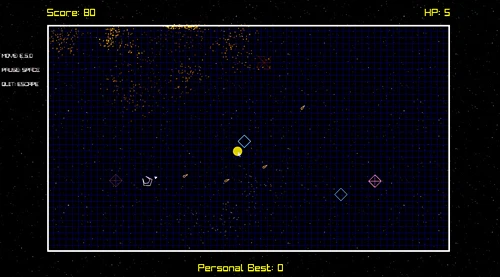

# GeoStorm

## Project Description:

This game is a 2D **shoot'em up** made in **C#** using raylib. <br>
The objective of this project was to quickly familiarize oneself with the C# language through the development of a game.

<br>

## Preview:



<br>

## Controls:
- Move  → ```ESF```
- Shoot → ```Left Click```
- Aim &nbsp;&nbsp; → ```Mouse Cursor```

<br />
<hr />

Authors : **Matias Héno** & **Laurent Lin**

For [ISART Digital](https://www.isart.com)

<hr />